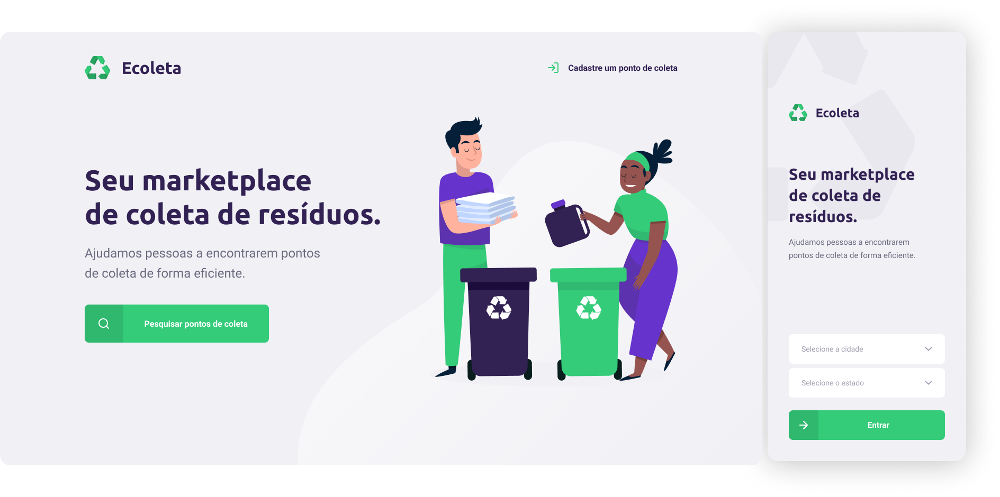

<div align="center">
  <a href="https://www.typescriptlang.org/">
    
  </a>
  <a href="https://nodejs.org/">
    
  </a>
  <a href="https://reactjs.org/">
    
  </a>
  <a href="https://reactnative.dev/">
    
  </a>
  <a href="https://github.com/amandabezerra/Ecoleta/blob/master/LICENSE">
    
  </a>
</div>

<br/>

<div align="center">
  <div>
    <a href="#tecnologias">Tecnologias</a>
    &nbsp;&nbsp;&nbsp;|&nbsp;&nbsp;&nbsp;
    <a href="#uso"> Instalação e Uso</a>
    &nbsp;&nbsp;&nbsp;|&nbsp;&nbsp;&nbsp;
    <a href="#layout">Layout</a>
    &nbsp;&nbsp;&nbsp;|&nbsp;&nbsp;&nbsp;
    <a href="#creditos">Créditos</a>
  </div>
  <br/>
  <div>
    
  </div>
</div>


<h2 id="tecnologias">:computer: &nbsp; Tecnologias</h2>

<h3>Server</h3>

+ [Node.js](https://nodejs.org/)
+ [Express](https://expressjs.com/)

<h3>Web</h3>

+ [React](https://reactjs.org/)
+ [React Leaflet](https://react-leaflet.js.org)
+ [React Dropzone](https://react-dropzone.js.org/)
+ [Axios](https://github.com/axios/axios)

<h3>Mobile</h3>

+ [React Native](https://reactnative.dev/)
+ [Expo](https://expo.io)
+ [Axios](https://github.com/axios/axios)


<h2 id="uso">:keyboard: &nbsp; Instalação e Uso</h2>

<h3>Server</h3>

+ Acesse a pasta /server

+ Instale as dependências:
```
$ npm install
```

+ Realize as migrações do banco de dados:

```
$ npm run knex:migrate
```

+ Insira os dados iniciais no banco:

```
$ npm run knex:seed
```

+ Inicie a aplicação:
```
$ npm run dev
```

+ A aplicação estará disponível em http://localhost:3333


<h3>Web</h3>

+ Acesse a pasta /web

+ Instale as dependências:
```
$ npm install
```

+ Inicie a aplicação:
```
$ npm start
```

+ Acesse a aplicação em http://localhost:3000


<h3>Mobile</h3>

+ Acesse a pasta /mobile

+ Instale as dependências:
```
$ npm install
```

+ Em [config](./mobile/src/config/index.ts) preencha seu *API_ADDRESS* e *API_PORT*. Por exemplo: `API_ADDRESS = '192.168.1.102', API_PORT ='3333'`

+ Inicie a aplicação:
```
$ npm start
```

+ Acesse http://localhost:19002/ para visualizar o QR code.

+ Abra o app [Expo](https://play.google.com/store/apps/details?id=host.exp.exponent) no seu Android ou o app Camera no iOS e scaneie o QR code para ter acesso a aplicação.


<h2 id="layout">:art: &nbsp; Layout</h2>

+ Os protótipos web e mobile estão disponíveis [aqui](https://www.figma.com/file/vgaPUHioL30RVaKQqeyunv/Ecoleta?).


<h2 id="creditos">:link:  &nbsp; Créditos</h2>

Este projeto foi produzido a partir das aulas da Next Level Week 1 da [Rocketseat](https://rocketseat.com.br/) :rocket: